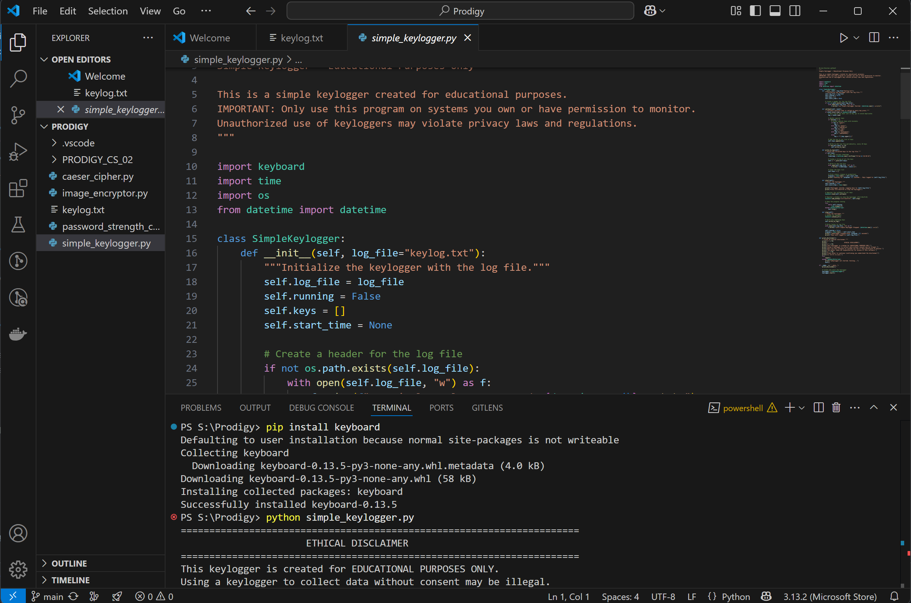

# PRODIGY_CS_04
 
 # 🛡️ KeyLogger
 
 The **Keylogger** is a simple application designed to track typed keys effortlessly via  the Dependency keyboard and create a log file to save the tracked keys
 . Built with **Keyboard**, this tool is for educational and study purpose.
 
 ---
 
 ##  Features
 ✔️ **Text file** for storing data
 ✔️ **User-Friendly** for easy operation  
 ✔️ **Accurate Keylog Tracking**   
 ✔️ **Lightweight & Fast Processing**  
 
 ---
 
 ##  Get Started
 ### 1️⃣ Clone the Repository  
 ```sh
  git clone https://github.com/MuhdSulthan/PRODIGY_CS_04.git
  cd PRODIGY_CS_04
 ```
 ### 2️⃣ Install Dependencies  
 ```sh
  pip install keyboard
 ```
 ### 3️⃣ Run the Application  
 ```sh
  python simple_keylogger.py
 ```
 ## 📸 Preview
 🔹 **Application**  
 
